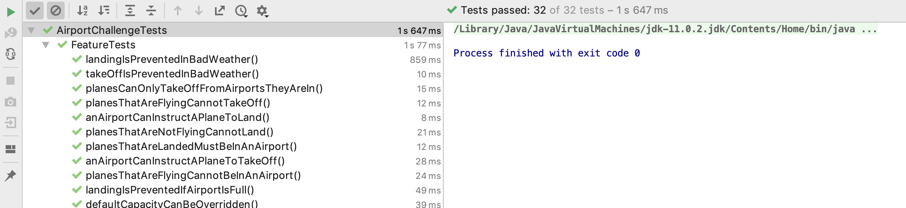

# Airport Challenge in Java

In this project I test-drove a solution to the airport challenge in Java, a language I had never used before. The Airport Challenge involves a small number of classes interacting, and test-driving it successfully requires techniques like the use of mocks and dependency injection, and stubbing out random behaviour.

*[Exercise instructions](exercise-instructions.md)*


## Instructions

1. Clone repo
2. Open `AirportChallenge` folder in your favourite Java IDE
3. Compile it
4. Run a REPL and import the Airport Challenge classes, and you can create planes and airports and run their methods. For instance in Groovy Console in IntelliJ:
    ```
    > import AirportChallenge.*
    > Airport airport = new Airport()
    > Plane plane = new Plane()
    > airport.clearForLanding(plane)
    > airport.contains(plane)

    Result: true
    ```
    ```
    > import AirportChallenge.*
    > Airport airport = new Airport()
    > Plane plane = new Plane()
    > airport.clearForLanding(plane)
    > airport.clearForLanding(plane)
    AirportChallenge.PlaneException: Plane could not land. Plane is not flying.
    ```
    ```
    > import AirportChallenge.*
    > Airport airport = new Airport()
    > Plane plane = new Plane()
    > airport.clearForLanding(plane)
    > airport.clearForTakeOff(plane)
    > airport.contains(plane)

    Result: false
    ```

### Behaviour

See the [instructions](exercise-instructions.md) for user stories.

1. Airports can tell planes to land or take off:  
    `airport.clearForLanding(plane)`  
    `airport.clearForTakeOff(plane)`
2. With a chance of 25% the weather will be too bad for take off/landing
3. Airports have a default maximum capacity which can be overridden when initialising
4. Planes can only take off from airports they are in, they can only take off if they are landed, and they can only land if they are flying

## Tests

Use your IDE to run the tests found in in `AirportChallenge/src/test/java/AirportChallengeTests`.



## Technology

- Java
- JUnit5
- Mockito
- Maven
- JShell
- Intellij IDEA

## Process

*[All the notes I made along the way](notes.md)*

My target was to complete a full solution to the Airport Challenge, implementing all the users stories and edge cases.

This was a sequel to my [Airport Challenge in Javascript](https://github.com/Hives/airport-challenge-javascript), where I did the same exercise in JavaScript, a language in which I did have some experience.

This was much harder! I found many resources for beginners in Java, and many resources for beginners in JUnit, the most popular Java test framework, but the JUnit resources assumed more knowledge of Java than I had. There was not much help for people who were beginners in both.

My biggest problem at first was working out how to structure a Java project - what folders you need to make modules and packages which can easily be compiled. A lot of resources were telling me to use an IDE to set up my project, but I was resistent to this - I wanted to do it all manually, to better learn how it worked. I managed to do some simple exercises like this, [FizzBuzz](https://github.com/Hives/java-stuffs/tree/master/FizzBuzz) and then [TDDing FizzBuzz](https://github.com/Hives/java-stuffs/tree/master/TDDFizzBuzz), both completed using Vim and compiling and running from the command line. This taught me the basics about Java's static typing, and compiling and running source code and JUnit tests.

But when I started on the Airport Challenge, a more complicated program with multiple source and test files, I ran into trouble trying to manage everything manually. I then began to oscillate between trying to set up my source and test code in IntelliJ IDEA, and doing it manually in the command line. After getting stuck with one method I would suspect that the other method might be easier, and switch to that. After a morning's work I didn't start really making progress until I took a break and came back to it two weeks later.

In this period when I wasn't making much progress I wasn't ever totally stuck - I was learning, but slowly! This would have been a good time to ask for help, but I wanted to have the experience of learning something on my own.

In the end I did settle on working in IntelliJ, and using that to structure my project. Once I got going with that progress was at a steady pace. Other hurdles along the way were:
- Working out how to import my module into JShell so I could manually test it
- Working out how to use Maven in IntelliJ to manage dependencies, to pull in Mockito, a mocking framework for Java.
- Working out how to test for exceptions in Java I found confusing, until I figured out the meaning of the error messages I was getting

As with the JavaScript airport challenge I found that TDD concepts like the red/green/refactor cycle, using dependency injection to make tests independent, and mocking were easily translatable into Java and could be implemented without too much trouble.

Java gives you way more error messages than Ruby and Javascript, even before the tests run. e.g. this error telling me the `airport.clearForTakeOff` method doesn't exist comes from the compiler, not the test
```
AirportTest.java:44: error: cannot find symbol
    airport.clearForTakeOff(plane2);
            ^
symbol:   method clearForTakeOff(Plane)
location: variable airport of type Airport
```
But you can apply the same BDD logic to these compiler errors - get your feature and unit tests to produce the same compiler errors, and then write the code to fix them.

Initially I used a builder constructor for my Airport class as it allowed me to have multiple optional arguments in the constructor. [See this commit](https://github.com/Hives/airport-challenge-java/commit/f0ff4f72711b5ea585caa3c0c1f621a30cb03583). After talking to Katerina and Michael it turns out that you don't need to do this - you can have multiple constructors, as I was doing before (overloaded constructor), and because Java is statically typed, if you only pass in one parameter to the constructor, it can tell whether to use the one where you provide a Weather object, or an integer capacity. [See this commit](https://github.com/Hives/airport-challenge-java/commit/6768e80ff527a285b01496773df54250f9e66756). I guess this is only feasible if the parameter are of different types, otherwise it would have no way of knowing which was which.
